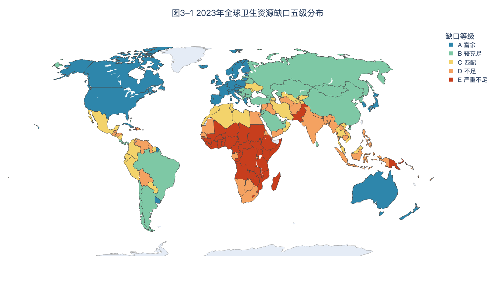
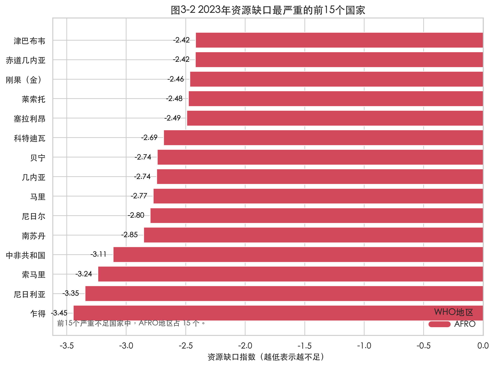
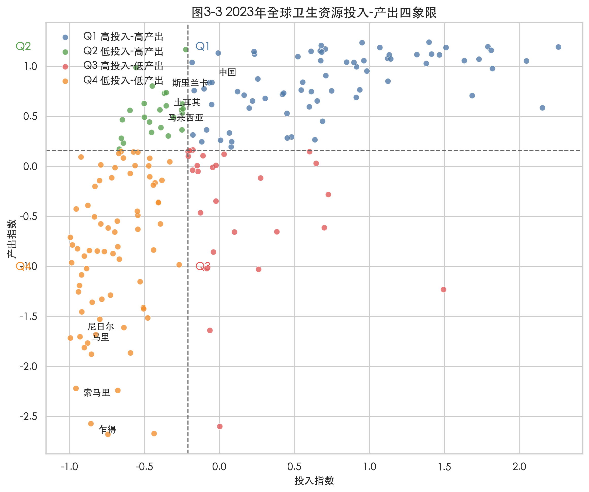
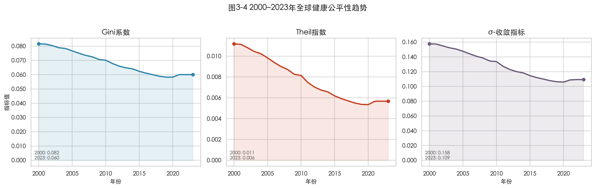
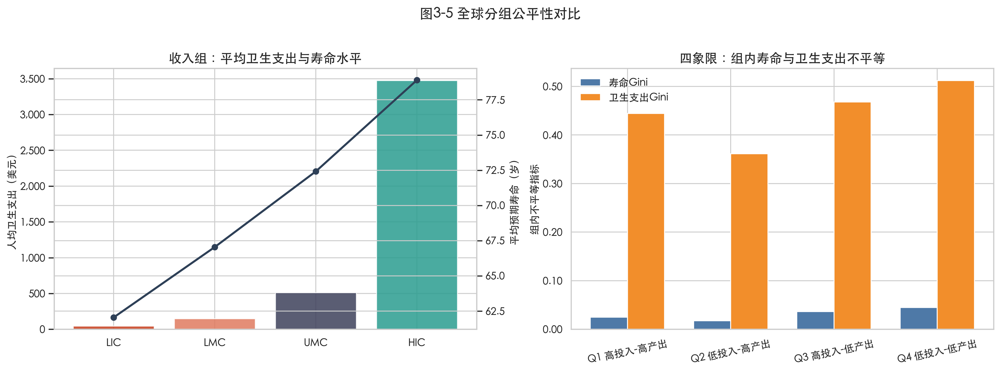
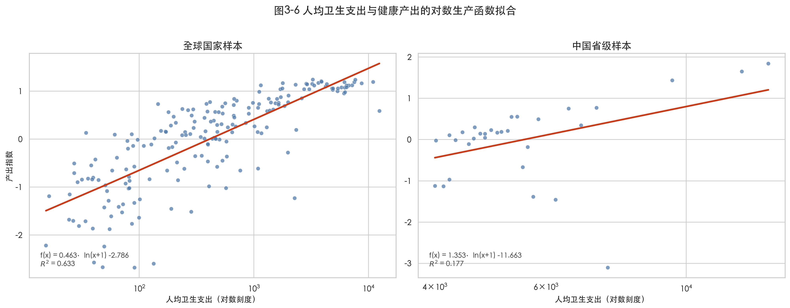
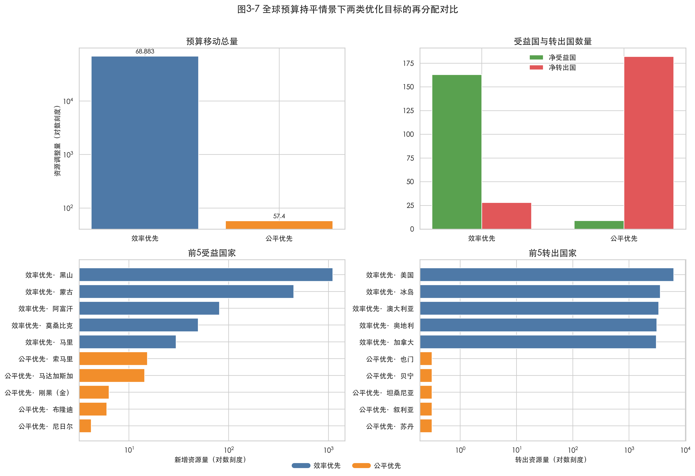
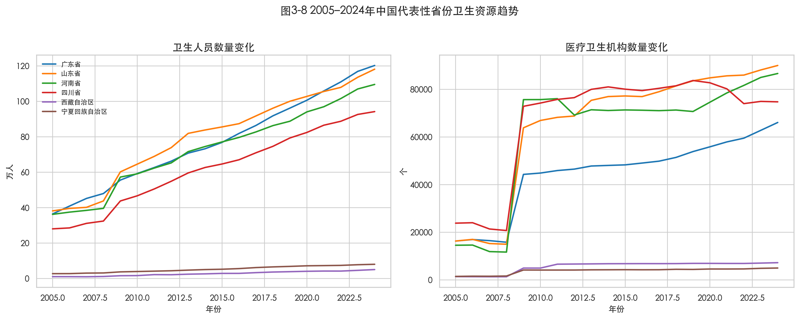
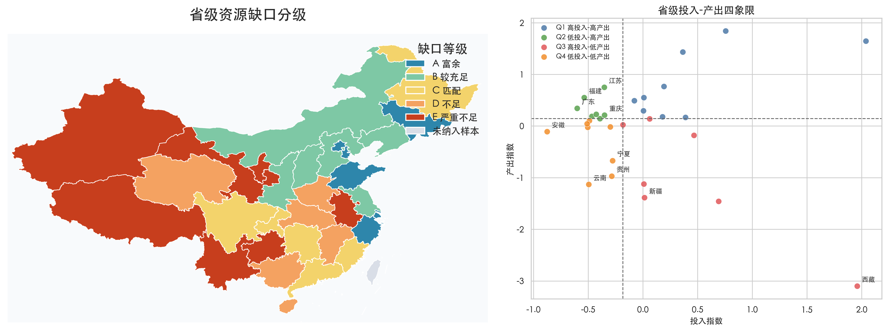
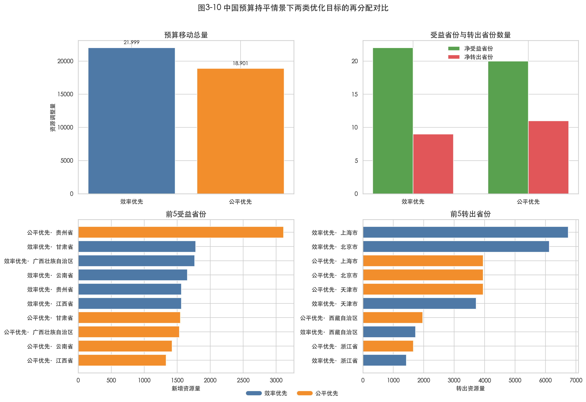

# 问题3重述

评估各国卫生资源（如医生密度、卫生支出）配置与疾病负担的匹配程度，识别“资源配置不足”或“健康产出低下”的区域，并提出数据驱动的优化见解。

(1) 测算各国“实际资源配置水平”与“基于其疾病负担的理论需求水平”之间的缺口，**并在地图上进行分级标注**

(2) 建立评估矩阵，将各国分为“高投入-高产出”、“高投入-低产出”、“低投入-高产出”、“低投入-低产出”**四种类型**，并分析其健康结果在不同人群间的**公平性**

(3) 设定“最大化健康产出”或“最小化健康不平等”等不同目标，通过数学规划模型，模拟卫生资源（如医疗人力、资金）在各国或一国内部的最优再分配方案

(4) 根据评估与模拟结果，为“高投入-低产出”地区提供以提升管理效率为核心的建议，为“低投入-高产出”地区总结可推广经验，为“低投入-低产出”地区设计增加基础投入与改善效率并行的综合性方案


# 数据集与预处理

## 数据集介绍

### 01 全球各国核心疾病与死亡估算数据

2000-2023年某国家死于某种疾病的人数, 包括上下界限。

22 类死因: 心血管疾病、肿瘤、慢性呼吸系统疾病、糖尿病和肾病、消化系统疾病、神经系统疾病、精神障碍、物质使用障碍、肌肉骨骼疾病、皮肤和皮下疾病、感觉器官疾病、呼吸道感染及结核病、肠道感染、艾滋病毒/艾滋病和性传播感染、被忽视的热带病和疟疾、其他传染性疾病、孕产妇和新生儿疾病、营养不良、意外伤害、运输伤害、自残和人际暴力、其他非传染性疾病

```csv
Population,地理位置,年份,年龄,性别,死亡或受伤原因,测量,数值,下限,上限
全人口,澳大利亚,2000,全部,合计,艾滋病毒/艾滋病和性传播感染,死亡排名,17,,
全人口,澳大利亚,2000,全部,合计,艾滋病毒/艾滋病和性传播感染,死亡,175.85,152.97,197.97
全人口,奥地利,2000,全部,合计,艾滋病毒/艾滋病和性传播感染,死亡排名,16,,
```

### 02 全球各国健康风险因素数据

来源: IHME GBD, 数据结构与01类似，但是02->01没有对应，应该是健康风险导致疾病导致死亡（寿命）。

```csv
Population,地理位置,年份,年龄,性别,死亡或受伤原因,风险因素,测量,数值,下限,上限
全人口,澳大利亚,2000,全部,合计,所有原因,不安全的水，环境卫生和洗手,死亡排名,20,,
全人口,澳大利亚,2000,全部,合计,所有原因,不安全的水，环境卫生和洗手,死亡,45.90,1.57,115.02
全人口,奥地利,2000,全部,合计,所有原因,不安全的水，环境卫生和洗手,死亡排名,20,,
全人口,奥地利,2000,全部,合计,所有原因,不安全的水，环境卫生和洗手,死亡,15.47,-0.59,39.44
```

20 类风险因素: 高血压、高BMI指数、高血糖、高低密度脂蛋白胆固醇、烟草烟雾、饮酒、饮食风险、空气污染、不安全的水/环境卫生和洗手、不安全性、身体活动不足、低骨密度、肾脏功能受损、儿童和孕产妇营养不良、儿童虐待、亲密伴侣间的暴力、职业风险、用药、其他环境危险因素、体温


### 03 全球各国健康营养和人口统计数据

Glossary为指标词典，主数据 `WB_HNP.csv`包含各个国家多年的数据2.5GB，与同样来自世界银行的04数据有重复，当重复时以03为准，如果数据缺失则回退到04。

- SP : 人口统计相关
- SH : 健康相关
- SN : 营养相关
- SE : 教育相关
- SL : 劳动力相关

### 04 · 社会经济指标

世界银行 World Development Indicators (WDI) 完整导出，共 6 个文件。各个国家的经济发展相关数据。

世界银行 WDI 数据集包含 6 个核心 CSV 文件，各自承担不同的数据角色：

- **`WDICSV.csv`**：核心指标时间序列数据，采用“国家 × 指标 × 年份”的数值矩阵形式，存储各国家、各年份的实际数值（如“非洲东部和南部在 2023 年清洁烹饪燃料普及率为 22.54%”），列包括 `Country Name`、`Country Code`、`Indicator Name`、`Indicator Code` 以及从 1960 到 2024 的年份列。
- **`WDICountry.csv`**：国家/地区/分组元数据文件，定义每个国家（及分组）的背景属性，包括代码、名称、货币、区域、**收入组**、统计体系、最新普查年份等。**收入组分类（LMC、UMC、HIC 等）在此文件中定义**。
- **`WDISeries.csv`**：指标元数据文件，解释每个指标的含义、计算方法和数据来源，例如 `SP.DYN.LE00.IN` 对应“出生时预期寿命（岁）”，列包括 `Series Code`、`Indicator Name`、`Short definition`、`Unit of measure`、`Source` 等。
- **`WDIcountry-series.csv`**：国家‑指标关联说明文件，记录哪些国家/分组拥有该指标，以及其数据来源或计算方法（如“低收入组（LIC）的卫生指标由 WHO/UNICEF JMP 计算”），列包括 `CountryCode`、`SeriesCode`、`DESCRIPTION`。
- **`WDIfootnote.csv`**：数据脚注文件，提供特定国家‑指标‑年份的备注，例如 PPP 估计基准年、数据修订说明等，涉及数据质量、估计方法或特殊处理，列包括 `CountryCode`、`SeriesCode`、`Year`、`DESCRIPTION`。
- **`WDIseries‑time.csv`**：指标时间覆盖范围文件，说明每个指标在 WDI 数据库中的时间跨度（如某些指标仅从 1990 年开始有数据），列包括 `SeriesCode`、`Year`、`DESCRIPTION`。

`WDICountry.csv` 提供国家分类 → `WDICSV.csv` 提供指标数值 → `WDISeries.csv` 解释指标含义 → 其他文件补充关联、脚注和时间信息。


### 05 · 中国卫生数据

来源：国家统计局，覆盖 31 省（不含台湾省与香港、澳门） × 20 年 (2005-2024)。各省卫生人员数量、各省医疗卫生机构数量从2005-2024的变化，还包含了出生率、死亡率、自然增长率、平均预期寿命（总体、男性、女性）。

## 数据预处理

### Problem 3 预处理

从03与04数据集中提取出了下列一级指标，再通过一级指标计算二级指标：

#### 医生密度(physicians_per_1000, Phys)

数据来自 `03 Glossary` 中 `SH.MED.PHYS.ZS` 指标，如果03数据缺失，回退到04。Phys单位为每千人。

#### 床位密度(beds_per_1000, Beds)

数据来自 `03 Glossary` 中 `SH.MED.BEDS.ZS` 指标，如果03数据缺失，回退到04。Beds单位为每千人。

#### 卫生支出占GDP(health_exp_pct_gdp, HExp)

数据来自 `04 Glossary` 中 `SH.XPD.CHEX.GD.ZS` 指标。HExp单位为百分比。

#### 人均卫生支出(health_exp_per_capita, HExpPC)

数据来自 `04 Glossary` 中 `SH.XPD.CHEX.PC.CD` 指标。HExpPC单位为当前美元。

#### 传染性疾病占比(communicable_share, CommSh)

数据来自 `01 全球主要国家死亡原因` 各年度CSV，基于 `死亡或受伤原因` 与 `测量=死亡` 归并计算。CommSh单位为比例（0-1）。

#### 婴儿死亡率(infant_mortality, IMR)

数据来自 `03 Glossary` 中 `SP.DYN.IMRT.IN` 指标，如果03数据缺失，回退到04。IMR单位为每千活产儿。

#### 5岁以下死亡率(under5_mortality, U5MR)

数据来自 `03 Glossary` 中 `SH.DYN.MORT` 指标，如果03数据缺失，回退到04。U5MR单位为每千活产儿。

#### 预期寿命(life_expectancy, LE)

数据来自 `03 Glossary` 中 `SP.DYN.LE00` 指标(后缀全体/女/男: `.IN`/`.FE.IN`/`.MA.IN`)，如果03数据缺失，回退到04。LE单位为岁。

# Model 3: 医疗资源模型

## Problem 3-1: 资源缺口

定义投入、产出、需求指数三个二级指标，以构造三级指标**资源缺口**。

**投入指数**（实际资源水平）：

$$I_i^{\text{input}} = \frac{1}{4}\left[z(\text{Phys}_i) + z(\text{Beds}_i) + z(\text{HExp\%}_i) + z(\text{HExpPC}_i)\right]$$

**产出指数**（健康结果）：

$$I_i^{\text{output}} = \frac{1}{3}\left[z(\text{LE}_i) + z^{-}(\text{IMR}_i) + z^{-}(\text{U5MR}_i)\right]$$

**理论需求指数**：

$$I_i^{\text{need}} = \frac{1}{4}\left[z(\text{CommSh}_i) + z(\text{IMR}_i) + z(\text{U5MR}_i) + z^{-}(\text{LE}_i)\right]$$

**资源缺口**：

$$\text{Gap}_i = I_i^{\text{input}} - I_i^{\text{need}}$$

$\text{Gap}_i < 0$ 表示资源低于理论需求。本文按截面五分位数将各国划分为 A（富余）至 E（严重不足）五级，并以 2023 年最新截面为主进行识别。





图3-1显示，资源富余区域主要集中在北美、西欧、大洋洲和东亚高收入经济体，而严重不足区域明显聚集在撒哈拉以南非洲。图3-2进一步给出缺口最严重国家的排序：2023 年资源缺口最严重的前 15 个国家**全部位于 AFRO 地区**，其中前五位依次为乍得、尼日利亚、索马里、中非共和国和南苏丹。这说明问题三第(1)问所要求的“理论需求缺口”并非均匀分布，而是高度集中在基础卫生体系薄弱、疾病负担较重的国家群体。

## Problem 3-2: 医疗分类与公平性

### 国家分类

按照地理位置，根据 WHO 官方定义分为六个地区：

- AFRO: African Region 非洲区域
- EURO: European Region 欧洲区域
- WPRO: Western Pacific Region 西太平洋区域
- SEARO: South‑East Asia Region 东南亚区域
- AMRO: Region of the Americas 美洲区域
- EMRO: Eastern Mediterranean Region 东地中海区域

按照经济发展水平分类，`WDICountry.csv` 中列名 `Income Group` 将所有国家划分为 High income (HIC)、Low income (LIC)、Lower middle income (LMC)、Upper middle income (UMC) 四类。

### 评估矩阵

以投入指数中位数 $M^{\text{input}}$ 和产出指数中位数 $M^{\text{output}}$ 为阈值，将各国分为“高投入-高产出”“高投入-低产出”“低投入-高产出”“低投入-低产出”四种类型：

$$Q_i = \begin{cases} \text{Q1: 高投入–高产出} & \text{if } I_i^{\text{input}} \geq M^{\text{input}} \land I_i^{\text{output}} \geq M^{\text{output}} \\ \text{Q2: 低投入–高产出} & \text{if } I_i^{\text{input}} < M^{\text{input}} \land I_i^{\text{output}} \geq M^{\text{output}} \\ \text{Q3: 高投入–低产出} & \text{if } I_i^{\text{input}} \geq M^{\text{input}} \land I_i^{\text{output}} < M^{\text{output}} \\ \text{Q4: 低投入–低产出} & \text{if } I_i^{\text{input}} < M^{\text{input}} \land I_i^{\text{output}} < M^{\text{output}} \end{cases}$$



2023 年可完成分类的国家中，Q1、Q2、Q3、Q4 四类国家数量分别为 **71、24、26、72**，另有 10 个国家因关键投入指标缺失未纳入象限统计。图3-3显示，日本、瑞士、澳大利亚等典型高收入国家位于 Q1；土耳其、斯里兰卡、马来西亚等国家处于 Q2，体现出“较少投入取得较高产出”的效率特征；乍得、索马里、尼日尔、马里等国家集中在 Q4，是资源不足与健康结果偏弱的双重脆弱区。

| 象限 | 含义 | 代表国家 |
| ---- | ---- | -------- |
| Q1 | 高投入–高产出 | 日本、瑞士、澳大利亚 |
| Q2 | 低投入–高产出 | 土耳其、斯里兰卡、马来西亚等 24 国 |
| Q3 | 高投入–低产出 | 需重点关注治理效率与资源结构 |
| Q4 | 低投入–低产出 | 乍得、索马里、尼日尔、马里等 72 国 |

### 公平性分析

赛题第(2)问要求在四象限分类之外进一步分析健康结果的公平性。本文以国家截面为公平性分析单位，从时间演化与分组差异两个层面刻画不平等。

#### 指标定义

##### 寿命基尼系数（Gini）

对每个年份 $t$，从全球国家截面中提取健康结果变量 `life_expectancy`（出生时预期寿命）进行不平等测度。记 $y_i$ 或 $y_{it}$ 为国家 $i$ 在年份 $t$ 的预期寿命，$n$ 为该年纳入分析且 `life_expectancy` 非缺失的国家数量，$\bar{y}$ 为该年各国预期寿命均值。

$$G = \frac{\sum_{i=1}^{n}\sum_{j=1}^{n}|y_i - y_j|}{2n^2 \bar{y}}$$

利用等价秩公式可以加速计算：

$$G = \frac{2\sum_{i=1}^{n} i \cdot y_i}{n \sum_{i=1}^{n} y_i} - \frac{n+1}{n}$$

当 $G=0$ 时为完全平等，$G=1$ 为绝对不平等。

##### 寿命泰尔指数（Theil）

$$T = \frac{1}{n}\sum_{i=1}^{n}\frac{y_i}{\bar{y}}\ln\frac{y_i}{\bar{y}}$$

并可分解为区域间与区域内两部分：

$$T = T_{\text{between}} + T_{\text{within}} = \sum_{g} s_g \ln\frac{s_g}{f_g} + \sum_{g} s_g T_g$$

其中，$g$ 表示国家分组，本文取 WHO 地区；$f_g = n_g / n$ 为该组国家数占比，$s_g = \sum_{i \in g} y_i / \sum_i y_i$ 为该组预期寿命总量占比，$T_g$ 为组内 Theil 指数。

##### σ-收敛

$$\sigma_t = \sqrt{\frac{1}{n}\sum_{i=1}^{n}\left[\ln(y_{it}) - \overline{\ln(y_t)}\right]^2}$$

$\sigma_t$ 衡量年份 $t$ 全球国家间健康结果的离散程度；若 $\sigma_t$ 随时间下降，则说明各国预期寿命呈收敛趋势。

### 分析结果





图3-4表明，2000–2023 年全球健康不平等总体呈收敛趋势：预期寿命 Gini 系数由 **0.0816** 下降至 **0.0600**，Theil 指数由 **0.0112** 下降至 **0.0057**，σ-收敛指标由 **0.1577** 下降至 **0.1093**。这说明全球平均寿命水平在抬升的同时，国家间差距也在缩小。

图3-5进一步揭示了“不同人群间公平性”的结构差异。从收入组看，HIC 国家平均预期寿命为 **78.90 岁**、平均人均卫生支出为 **3472.17 美元**，而 LIC 国家分别仅为 **62.05 岁**和 **43.38 美元**，显示出显著的阶梯式落差。从四象限内部看，Q2 组内寿命 Gini 最低（**0.0173**），说明这一类“低投入-高产出”国家不仅平均产出较高，内部差异也相对较小；Q4 组内卫生支出 Gini 最高（**0.5119**），说明弱势国家内部的资源不均衡问题仍较突出。2023 年全球人均卫生支出 Gini 达 **0.6919**，而“按支出排序的寿命集中指数”为 **0.0501**，说明健康结果仍然轻度集中于高支出国家。

因此，赛题第(2)问中的公平性分析可以概括为两层结论：一是全球健康不平等在长期上确有缓解；二是收入层级与象限类型仍然决定了不平等的主要结构来源，尤其是 AFRO 地区和 Q4 象限国家，仍是全球健康收敛的关键短板。

## Problem 3-3: 资源分配（数学规划）

为响应赛题中“最大化健康产出”与“最小化健康不平等”的资源再分配要求，本文分别在**全球国家间**和**中国省级内部**构建约束优化模型。当前实现中，决策变量采用 `health_exp_per_capita`（人均卫生支出）作为卫生资源投入代理，即以资金投入代表可再分配的卫生资源总量；医疗人力指标则在扩展实验中单独模拟，不与财政变量混合求解。

### 生产函数拟合

以人均卫生支出 $x_i$ 为投入、产出指数 $y_i$ 为产出，拟合对数生产函数：

$$f(x) = a \cdot \ln(x + 1) + b$$

全球国家情景下，$x_i$ 表示国家 $i$ 的人均卫生支出，$y_i = I_i^{\text{output}}$ 表示由预期寿命、婴儿死亡率（反向）和 5 岁以下死亡率（反向）构成的综合健康产出指数。中国省级情景下，$x_i$ 表示省份 $i$ 的人均卫生支出，$y_i$ 为由预期寿命和婴儿死亡率（反向）构成的省级健康产出指数。参数 $a,b$ 由当前截面拟合得到，用于刻画“新增投入带来递减边际产出”的经验关系。



图3-6显示，全球国家截面的对数生产函数拟合度较好（$R^2 = 0.633$），说明国际横截面上卫生支出能够解释相当比例的产出差异；中国省级样本的拟合度较弱（$R^2 = 0.177$），这意味着在省际层面，财政投入之外的人口结构、基层服务能力和治理水平等因素同样重要。

### 总产出最大化模型（效率优先）

“最大化健康产出”通过注水模型求解：

$$\begin{aligned} \max_{\mathbf{x}} \quad & \sum_{i=1}^{n} f(x_i) = \sum_{i=1}^{n} \left[a \cdot \ln(x_i + 1) + b\right] \\ \text{s.t.} \quad & \sum_{i=1}^{n} x_i \leq B \\ & x_i^{\min} \leq x_i \leq x_i^{\max}, \quad i = 1, \ldots, n \end{aligned}$$

其中，$x_i^{\text{current}}$ 为地区 $i$ 当前的人均卫生支出，$B = \alpha \cdot \sum_i x_i^{\text{current}}$ 为预算总量。本文设置三种预算情景 $\alpha \in \{0.9, 1.0, 1.1\}$，分别表示预算缩减 10\%、预算持平和预算增加 10\%。在“总产出最大化”目标下，约束区间设为 $x_i^{\min} = 0.5 \cdot x_i^{\text{current}}$，$x_i^{\max} = 2.0 \cdot x_i^{\text{current}}$，以避免不现实的极端抽离或过度集中。

由于目标函数为可分离凹函数，最优解具有**注水（Water-Filling）结构**：

$$x_i^* = \text{clip}(\mu, \; x_i^{\min}, \; x_i^{\max}), \quad \text{使得} \; \sum_i x_i^* = B$$

### Rawlsian 最小值最大化模型（公平优先）

“最小化健康不平等”通过 Rawlsian 最小值最大化模型求解，非线性模型采用 SLSQP 求解器：

$$\begin{aligned} \max_{\mathbf{x}, \tau} \quad & \tau \\ \text{s.t.} \quad & f(x_i) \geq \tau, \quad i = 1, \ldots, n \\ & \sum_{i=1}^{n} x_i \leq B \\ & x_i^{\min} \leq x_i \leq x_i^{\max} \end{aligned}$$

其中，辅助变量 $\tau$ 表示所有地区中最低可实现的健康产出水平。该模型遵循 Rawls “最弱者优先”原则，通过优先抬升最差地区的产出下限来改善公平性。在当前实现中，该目标下取 $x_i^{\min} = 0.3 \cdot x_i^{\text{current}}$，$x_i^{\max} = 2.0 \cdot x_i^{\text{current}}$，从而允许在公平导向下进行更大幅度倾斜。

### 全球规划

在三种预算水平（$\alpha = 0.9, 1.0, 1.1$）和两种优化目标下，本文共求解 6 种全球再分配方案。下面聚焦预算持平（$\alpha = 1.0$）的核心情景。



图3-7显示，在预算持平的**总产出最大化**情景下，模型覆盖 **191 个国家**，形成“**163 个净受益国、28 个净转出国**”的结构，总移动预算约为 **68883.39**。前五大净受益方分别为阿富汗、马里、黑山、蒙古和莫桑比克，前五大净转出方则为冰岛、澳大利亚、奥地利、加拿大和美国。这说明效率优先方案的逻辑不是简单地“从富国转向穷国”，而是优先流向那些**边际健康产出更高**的地区。

在预算持平的 **maximin** 情景下，资源集中度明显更强：仅有 **9 个净受益国**，但有 **182 个净转出国**，总移动预算仅为 **57.42**。前五大净受益方依次为索马里、马达加斯加、刚果（金）、布隆迪和尼日尔，几乎全部位于 AFRO 地区，且多数属于 Q4“低投入-低产出”国家。与效率优先相比，公平优先方案并不追求大范围调整，而是用更小的调整量优先抬升最低端国家的产出下限。

因此，全球最优再分配可以概括为两种不同的政策逻辑：若目标是提升总健康产出，应当将部分资源从高投入成熟国家转向边际回报更高的资源紧缺地区；若目标是降低全球健康不平等，则应更加定向地向 AFRO 地区和 Q4 象限国家倾斜。

### 中国省级规划

赛题第(3)问要求给出“在一国内部”的最优再分配方案。为此，本文利用 31 个省级行政区 2005–2024 年卫生人员与卫生机构数据，并结合最新年份的人均卫生支出、预期寿命和婴儿死亡率，构造中国省级子样本，在一国内部复刻资源缺口、四象限分类与优化模型。



图3-8显示，广东、山东、河南、四川等人口大省在卫生人员和医疗机构绝对规模上长期领先，而西藏、宁夏等西部省份虽然基数较低，但增长速度更快，体现出明显的追赶效应。也就是说，中国省级资源演化既有“总量扩张”，也有“空间再平衡”的特征。



图3-9中的台湾省、香港特别行政区和澳门特别行政区以灰色显示，仅表示地理位置；由于赛题第五类原始数据不覆盖这些区域，它们未纳入省级缺口测算与四象限统计。

从 2024 年最新截面看，31 个省级行政区在四象限中的分布为：**高投入-高产出 9 省、高投入-低产出 7 省、低投入-高产出 7 省、低投入-低产出 8 省**。其中，云南（-1.625）、新疆（-1.373）、贵州（-1.252）、西藏（-1.140）和甘肃（-1.114）是资源缺口最突出的地区。就类型而言，云南、贵州、安徽、宁夏等省份主要位于 Q4，表现为基础投入与健康产出双弱；新疆、西藏、甘肃、青海等省份则更多落在 Q3，表明仅提高投入总量并不能自动转化为更优的健康结果。相对而言，江苏、福建、广东、湖北、重庆等省份位于 Q2，是“低投入-高产出”的高效率样本。

省际公平性指标也支持这一判断。最新截面下，预期寿命 Gini 为 **0.0158**，说明寿命差距总体可控；但婴儿死亡率 Gini 为 **0.2331**、人均卫生支出 Gini 为 **0.1724**，表明弱势地区在母婴健康和财政资源可及性上仍存在明显差距。按卫生支出排序的寿命集中指数为 **0.0068**，说明健康结果在高支出地区略有集中，但集中程度并不强。



图3-10表明，在预算持平的省级**总产出最大化**情景下，22 个省份成为净受益方、9 个省份成为净转出方，总移动预算约为 **21999.21**。前五大净受益省份为甘肃、广西、云南、江西和贵州；前五大净转出省份为上海、北京、天津、西藏和浙江。若改用**公平优先**目标，则受益方向进一步向欠发达省份集中：前五大净受益省份为贵州、甘肃、广西、云南和江西，主要净转出方则为天津、北京、上海、西藏和浙江。可见，在一国内部，效率优先与公平优先都指向“中西部补短板”，但公平优先更强调对最弱省份的定向扶持。

## Problem 3-4: 建议

结合资源缺口、四象限分类与最优再分配结果，可将政策建议归纳为以下三类：

1. **高投入-低产出（Q3）地区：以提升管理效率为核心。** 这类地区投入水平并不低，但健康结果没有同步改善，说明问题更多来自资源结构与治理机制。对全球国家样本，应优先开展卫生体系效率审计、强化基层首诊和绩效预算，减少“高支出-低转化”现象；对中国省级样本，新疆、甘肃、西藏、青海等地更应关注基层资源布局、医防协同和绩效激励，而不是继续单纯扩张总量。

2. **低投入-高产出（Q2）地区：总结并推广可复制经验。** 这类地区说明“有限资源也可以做出较高产出”。全球样本中的土耳其、斯里兰卡、马来西亚、摩洛哥等国家，以及中国省级样本中的江苏、福建、广东、湖北、重庆等省份，都体现出较强的基层服务组织能力和成本控制能力。政策重点应是提炼其初级卫生保健网络、预防优先策略和分级诊疗经验，并将其转化为可复制的治理模板。

3. **低投入-低产出（Q4）地区：增投与提效并行。** 这类地区既缺资金、也缺产出，单靠管理优化难以快速改观。对于全球样本，应优先保障基础卫生设施、基层人力与母婴健康服务，并通过国际援助与技术合作提升资源可及性；对于中国省级样本，云南、贵州、安徽、宁夏等地更适合采用“财政补短板 + 基层人力扩充 + 服务效率提升”的双轨方案，同时借鉴 Q2 地区经验，避免新增投入再次落入低效扩张。

综合来看，问题三的最优方案不是单一地“多给资源”，而是**根据地区类型实施差异化治理**：Q3 强调提效，Q2 强调经验扩散，Q4 强调补短板与提效率同步推进。这样才能使“缺口识别—类型划分—优化模拟—政策建议”形成闭环。
