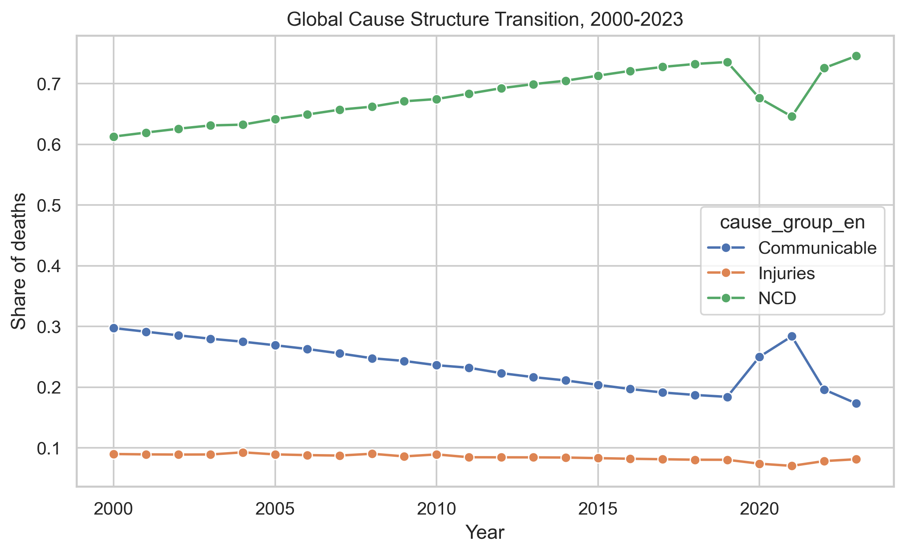
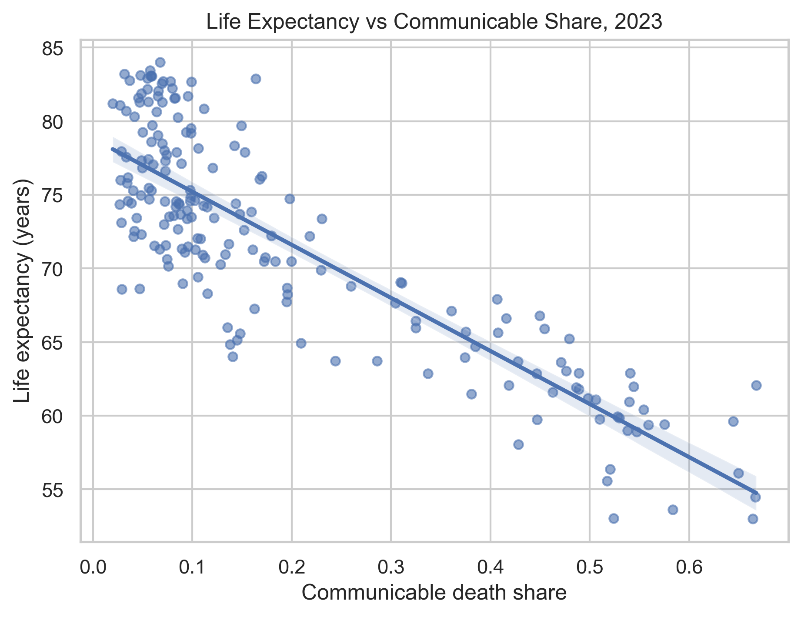
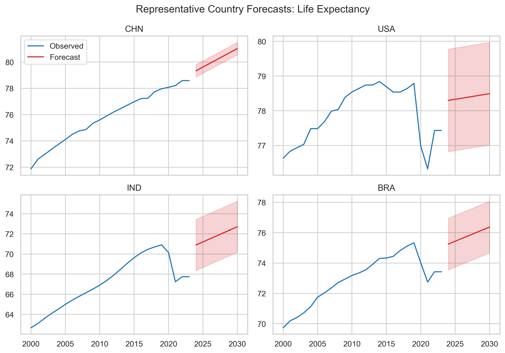
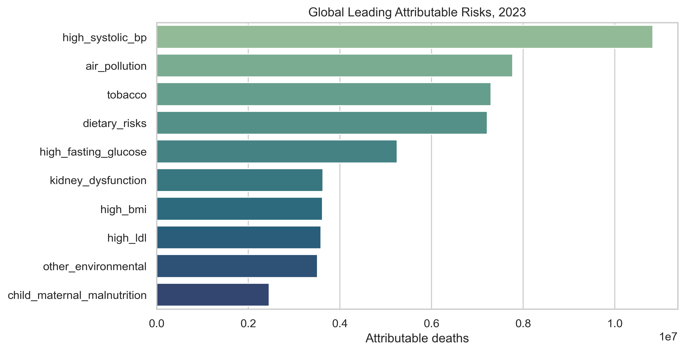
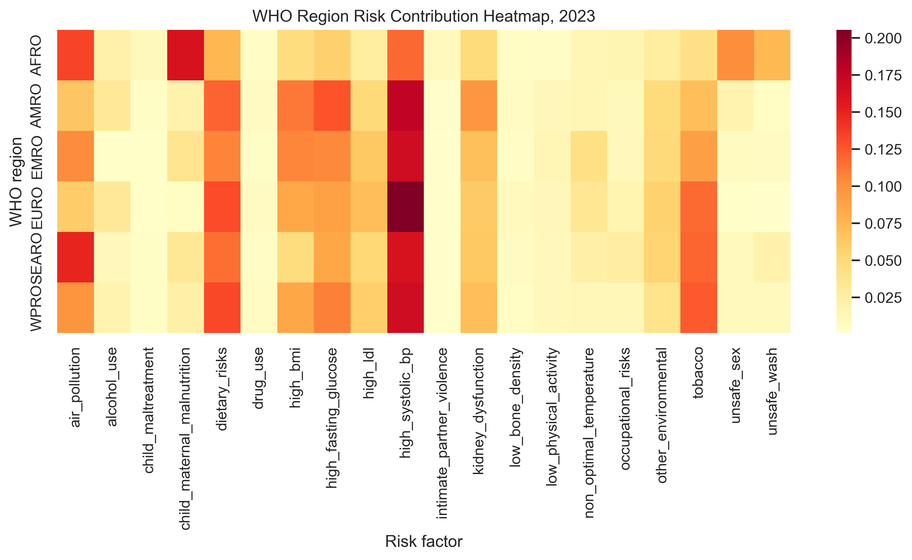
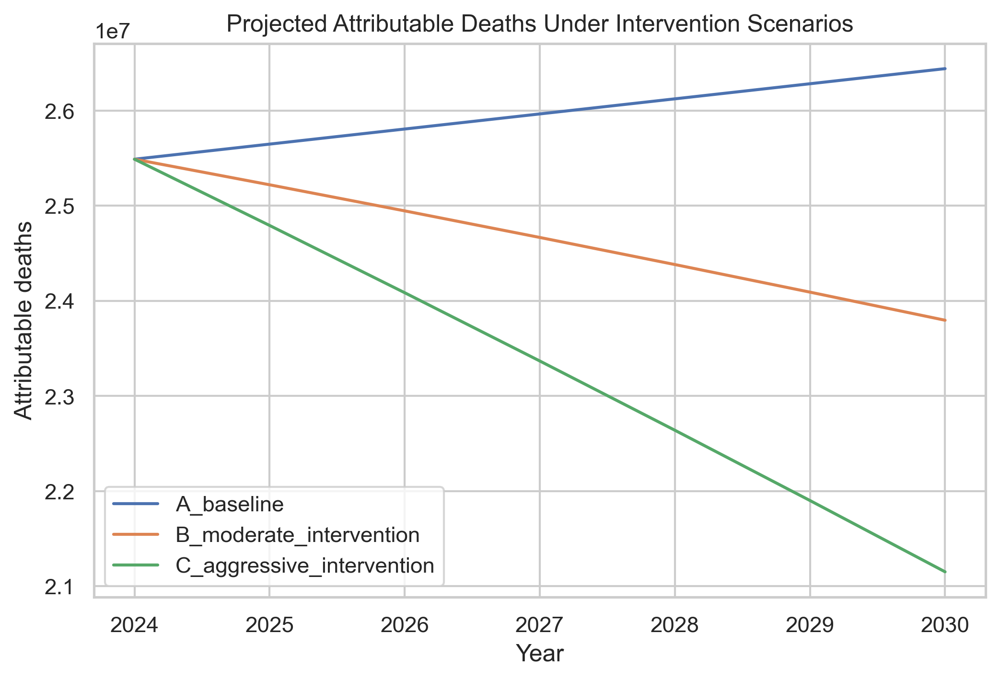
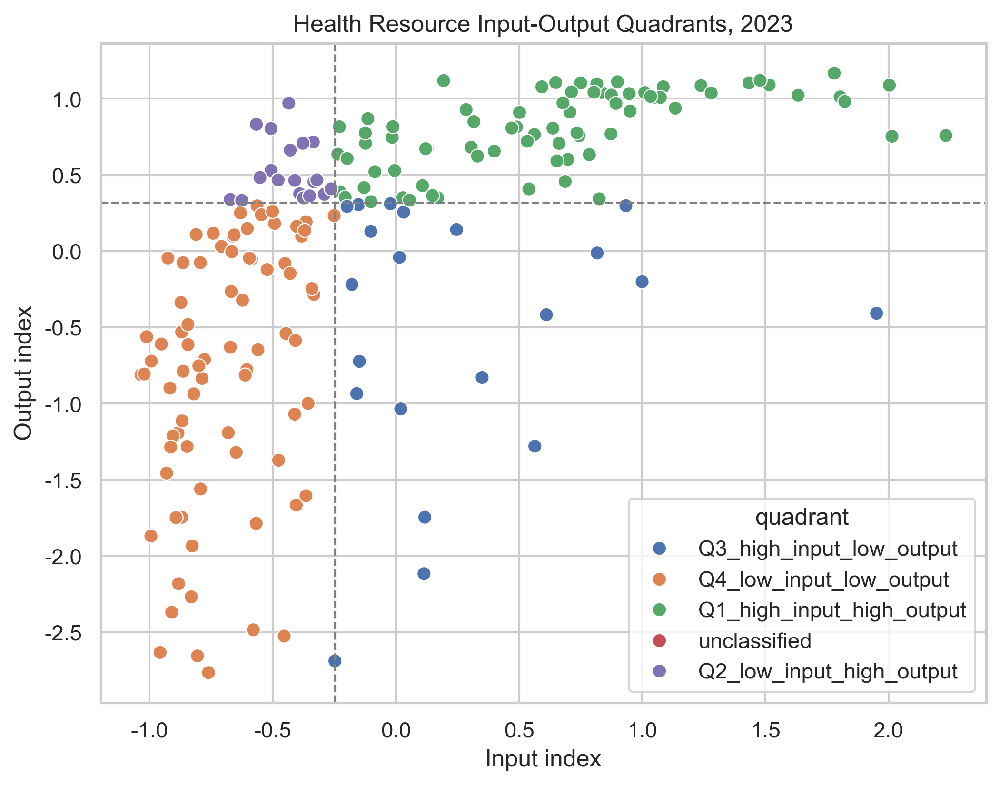
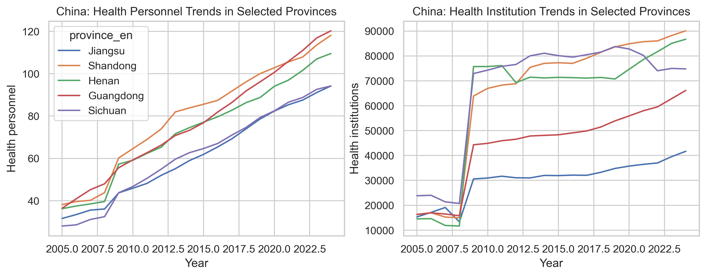

# 健康数据洞察：全球疾病谱演变、风险归因与卫生资源配置优化分析

**HdI 项目组**

**2026年3月**

---

## 摘要

本研究基于2026年（第19届）中国大学生计算机设计大赛大数据主题赛"健康数据洞察"赛题提供的5类数据集，对2000–2023年全球203个国家和地区的疾病谱演变、风险因素归因与卫生资源配置效率开展了系统性的数据驱动分析，并对中国近20年省级卫生数据进行深度补充刻画。

研究围绕赛题要求的三大核心维度展开：**维度一**（时空变迁）构建全球国家–年份主面板，量化疾病谱从传染病向非传染性疾病（NCD）转型的长期趋势，并以截面OLS回归识别预期寿命的关键解释变量（$R^2 = 0.906$）；**维度二**（风险归因）基于归因死亡数据建立风险贡献占比框架，结合人口归因分值（PAF）与Shapley值分解量化各风险因素的边际贡献，并构建三种未来干预情景；**维度三**（资源配置）采用标准化缺口指数与投入–产出四象限分类评估各国资源匹配程度，进而以对数生产函数为基础建立约束优化模型，分别求解总产出最大化与Rawlsian最小值最大化两类再分配方案。

在赛题主线之外，本项目提出两个原创分析维度：（1）**健康公平性分析**，计算全球预期寿命的Gini系数、Theil指数与σ-收敛指标，揭示国际健康不平等的长期演化趋势；（2）**中国省级深度聚焦**，利用赛题第五类数据对31个省级行政区卫生人员与卫生机构的时序演化与区域差异进行可视化分析。研究最终形成包含可复现数据处理程序、静态API输出、8幅分析图表、6张数据表格、交互式仪表盘与完整AI协作记录的全套交付物。

**关键词：** 疾病谱转型；人口归因分值；Shapley值分解；线性规划；DEA效率评估；健康公平；Gini系数；面板回归

---

## 目录

1. [研究背景与任务理解](#1-研究背景与任务理解)
2. [数据来源与处理流程](#2-数据来源与处理流程)
3. [方法论框架](#3-方法论框架)
4. [Dimension 1：全球疾病谱与健康差异](#4-dimension-1全球疾病谱与健康差异)
5. [Dimension 2：风险因素归因与干预优先级](#5-dimension-2风险因素归因与干预优先级)
6. [Dimension 3：卫生资源配置与优化](#6-dimension-3卫生资源配置与优化)
7. [原创维度一：健康公平性分析](#7-原创维度一健康公平性分析)
8. [原创维度二：中国省级深度聚焦](#8-原创维度二中国省级深度聚焦)
9. [可视化系统与交互式仪表盘](#9-可视化系统与交互式仪表盘)
10. [AI协作与可复现性](#10-ai协作与可复现性)
11. [结论与讨论](#11-结论与讨论)

---

## 1. 研究背景与任务理解

### 1.1 选题背景

"健康中国2030"战略纲要将"改善健康结果、降低风险暴露、优化资源配置"列为核心战略目标，联合国可持续发展目标（SDG 3）同样以"确保各年龄段所有人的健康生活和促进福祉"为追求。与传统只讨论单一疾病或单一指标的做法不同，本赛题强调用多源数据描述**健康生态系统**的多维结构，并在此基础上给出可复现、可解释、可执行的洞察。

全球健康格局正经历深刻转型：传染性疾病的控制取得了显著成就，但非传染性疾病（NCD）的负担持续上升；不同地区的主导风险因素差异显著；卫生资源在国际间的分配极不均衡。这些现实要求研究者从时空维度、因果维度和决策维度三个层面同时切入，才能形成完整的分析图景。

### 1.2 赛题任务与分析维度

本项目围绕赛题要求的三个核心维度展开，并提出两个原创扩展维度：

- **D1. 疾病谱时空变迁**：描述全球疾病谱从传染性疾病向NCD转移的时空过程，量化健康指标差异，并对代表国家进行趋势预测。
- **D2. 风险因素归因与干预优先级**：分析主要风险因素对全因死亡的归因贡献，构建未来情景模拟与分地区优先干预清单。
- **D3. 卫生资源配置与优化**：评估各国卫生资源投入与健康产出的匹配程度，识别资源不足或低效率区域，并给出约束优化下的再分配方案。
- **D4. 健康公平性分析**（原创维度）：利用不平等测度指标分析全球健康差距的长期趋势。
- **D5. 中国省级深度聚焦**（原创维度）：对中国31个省级行政区卫生资源的时序演化与区域差异进行深度分析。

---

## 2. 数据来源与处理流程

### 2.1 数据来源

本研究使用赛题提供的全部5类数据：

| 编号 | 名称 | 内容说明 | 时间跨度 |
|------|------|----------|----------|
| 1 | 全球疾病死亡数据 | 203个国家22个死因类别的死亡与DALY数据 | 2000–2023 |
| 2 | 健康风险因素数据 | 203个国家20个风险因素的归因死亡数据 | 2000–2023 |
| 3 | 健康营养和人口统计（HNP） | 预期寿命、婴儿死亡率、医疗资源等 | 多年 |
| 4 | 社会经济发展（WDI） | 人均GDP、城镇化率等社会经济指标 | 多年 |
| 5 | 中国卫生数据 | 31个省级行政区卫生人员与机构数量 | 2005–2024 |

### 2.2 数据清洗与标准化

#### 2.2.1 国家代码统一化

赛题数据以中文国家名为主键，与国际通用的ISO 3166-1 Alpha-3编码体系存在大量不一致。本项目构建了基于`pycountry`库与自定义别名映射的两阶段匹配器：

1. **精确匹配**：利用`pycountry`的中英文名称直接查找ISO3编码。
2. **模糊匹配与别名回退**：对匹配失败的中文名，使用手工维护的别名表进行二次匹配，覆盖率达100%。

#### 2.2.2 面板数据构建

将死亡数据中的22个死因类别归并为三大类（传染性疾病、非传染性疾病、伤害），然后与HNP、WDI指标按 `(iso3, year)` 键进行左连接，形成全球国家–年份主面板 `master_panel.parquet`。

| 原始类别 | 归并大类 |
|---------|---------|
| 心血管疾病、肿瘤、糖尿病和肾病、慢性呼吸系统疾病 | 非传染性疾病 |
| 艾滋病/性传播感染、呼吸道感染及结核病、肠道感染 | 传染性疾病 |
| 意外伤害、自残和人际暴力、运输伤害 | 伤害 |

#### 2.2.3 缺失值处理策略

对于面板数据中的缺失值，采用以下分层策略：

1. 对缺失率超过30%的变量列，从当次分析中排除；
2. 对缺失间隔 ≤ 2年的变量，使用线性插值填补：

$$\hat{x}_{i,t} = x_{i,t_1} + \frac{t - t_1}{t_2 - t_1}(x_{i,t_2} - x_{i,t_1}), \quad t_1 < t < t_2$$

其中 $t_1, t_2$ 为已观测的相邻年份。

3. 对尾部缺失，使用前向填充（last observation carried forward）。

#### 2.2.4 标准化方法

在需要进行跨变量比较时，采用Z-score标准化：

$$z_j = \frac{x_j - \bar{x}_j}{\sigma_j}$$

其中 $\bar{x}_j$ 和 $\sigma_j$ 分别为变量 $j$ 在截面上的均值和标准差。需要方向反转的变量（如死亡率越高越差），取 $z_j' = -z_j$。

最终产出三个核心数据资产：

- `master_panel.parquet`：全球国家–年份主分析面板（约200个国家 × 24年 × 28个变量）
- `resource_panel.parquet`：Dimension 3专用资源与产出面板
- `china_panel.parquet`：中国31省级行政区长表（2005–2024年）

---

## 3. 方法论框架

本节系统阐述各维度所采用的数学模型与统计方法。

### 3.1 截面OLS回归模型

对最新年份的截面数据，使用多元线性回归识别预期寿命的关键解释因素：

$$\text{LE}_i = \beta_0 + \beta_1 \ln(\text{GDP}_i) + \beta_2 \text{HealthExp}_i + \beta_3 \text{Phys}_i + \beta_4 \text{Water}_i + \beta_5 \text{Sanit}_i + \beta_6 \text{CommSh}_i + \beta_7 \text{NCDSh}_i + \varepsilon_i$$

其中 $\text{LE}_i$ 为国家 $i$ 的出生时预期寿命，$\ln(\text{GDP}_i)$ 为人均GDP的对数变换。模型参数通过最小二乘法（OLS）估计：

$$\hat{\boldsymbol{\beta}} = (\mathbf{X}^\top \mathbf{X})^{-1} \mathbf{X}^\top \mathbf{y}$$

拟合优度以决定系数 $R^2$ 衡量：

$$R^2 = 1 - \frac{\sum_{i=1}^{n}(y_i - \hat{y}_i)^2}{\sum_{i=1}^{n}(y_i - \bar{y})^2} = 1 - \frac{SS_{\text{res}}}{SS_{\text{tot}}}$$

### 3.2 面板固定效应模型与Driscoll-Kraay标准误

对面板数据，估计双向固定效应模型：

$$y_{it} = \alpha_i + \lambda_t + \mathbf{x}_{it}^\top \boldsymbol{\beta} + \varepsilon_{it}$$

其中 $\alpha_i$ 为国家固定效应，$\lambda_t$ 为时间固定效应，$\mathbf{x}_{it}$ 为时变解释变量向量。

为处理截面相关性与异方差，采用Driscoll-Kraay标准误，协方差矩阵估计为：

$$\widehat{\text{Var}}(\hat{\boldsymbol{\beta}}) = (\mathbf{X}^\top \mathbf{X})^{-1} \hat{\mathbf{S}} (\mathbf{X}^\top \mathbf{X})^{-1}$$

其中 $\hat{\mathbf{S}}$ 为基于Newey-West型核加权的HAC估计量：

$$\hat{\mathbf{S}} = \sum_{\ell = -m}^{m} w(\ell, m) \hat{\mathbf{\Gamma}}_\ell, \quad w(\ell, m) = 1 - \frac{|\ell|}{m+1}$$

### 3.3 Mundlak相关随机效应模型

为检验固定效应假设的必要性，补充估计Mundlak (1978) CRE模型：

$$y_{it} = \mathbf{x}_{it}^\top \boldsymbol{\beta} + \bar{\mathbf{x}}_i^\top \boldsymbol{\gamma} + \alpha_i + \varepsilon_{it}$$

其中 $\bar{\mathbf{x}}_i = \frac{1}{T_i}\sum_{t} \mathbf{x}_{it}$ 为个体在时间维度上的均值向量。若 $\boldsymbol{\gamma}$ 联合显著，则应使用固定效应。

### 3.4 人口归因分值（PAF）

人口归因分值（Population Attributable Fraction, PAF）量化单一风险因素对疾病负担的贡献。对于二值暴露：

$$\text{PAF} = \frac{p \cdot (RR - 1)}{1 + p \cdot (RR - 1)}$$

其中 $p$ 为暴露率，$RR$ 为相对危险度。

对于多水平暴露，推广为：

$$\text{PAF} = \frac{\sum_{k=1}^{K} p_k (RR_k - 1)}{1 + \sum_{k=1}^{K} p_k (RR_k - 1)}$$

可归因死亡数为：

$$D_{\text{attr}} = \text{PAF} \times D_{\text{total}}$$

### 3.5 联合PAF与独立性假设

当存在 $K$ 个相互独立的风险因素时，联合PAF为：

$$\text{JointPAF} = 1 - \prod_{k=1}^{K}(1 - \text{PAF}_k)$$

当风险因素间存在正相关时，上式会低估联合归因比例，需要采用Shapley值分解修正。

### 3.6 Shapley值分解

Shapley值源于合作博弈论，对风险因素 $i$，其Shapley值定义为：

$$\phi_i = \sum_{S \subseteq N \setminus \{i\}} \frac{|S|!\,(n - |S| - 1)!}{n!}\bigl[v(S \cup \{i\}) - v(S)\bigr]$$

其中 $N = \{1, 2, \ldots, n\}$ 为全部风险因素集合，$v(S)$ 为联盟 $S$ 的价值函数（联合PAF）：

$$v(S) = 1 - \prod_{k \in S}(1 - \text{PAF}_k)$$

Shapley值满足以下核心性质：
- **有效性**（Efficiency）：$\sum_{i=1}^{n} \phi_i = v(N)$
- **对称性**（Symmetry）：等价玩家获得相同分配
- **虚玩家性**（Null Player）：不产生边际贡献的玩家分配为零
- **可加性**（Additivity）：分配相对于价值函数线性

### 3.7 线性趋势预测与置信区间

采用线性趋势外推作为基线预测模型：

$$\hat{y}_t = \hat{\beta}_0 + \hat{\beta}_1 \cdot t$$

预测的95%置信区间为：

$$\text{CI}_{0.95}(t) = \hat{y}_t \pm 1.96 \cdot \text{RMSE}$$

其中均方根误差为：

$$\text{RMSE} = \sqrt{\frac{1}{n}\sum_{k=1}^{n}(y_k - \hat{y}_k)^2}$$

同时报告：

$$\text{MAE} = \frac{1}{n}\sum_{k=1}^{n}|y_k - \hat{y}_k|$$

$$\text{MAPE} = \frac{100\%}{n}\sum_{k=1}^{n}\left|\frac{y_k - \hat{y}_k}{y_k}\right|$$

### 3.8 资源缺口指数

**投入指数**（实际资源水平）：

$$I_i^{\text{input}} = \frac{1}{4}\left[z(\text{Phys}_i) + z(\text{Beds}_i) + z(\text{HExp\%}_i) + z(\text{HExpPC}_i)\right]$$

**产出指数**（健康结果）：

$$I_i^{\text{output}} = \frac{1}{3}\left[z(\text{LE}_i) + z^{-}(\text{IMR}_i) + z^{-}(\text{U5MR}_i)\right]$$

**理论需求指数**：

$$I_i^{\text{need}} = \frac{1}{4}\left[z(\text{CommSh}_i) + z(\text{IMR}_i) + z(\text{U5MR}_i) + z^{-}(\text{LE}_i)\right]$$

**资源缺口**：

$$\text{Gap}_i = I_i^{\text{input}} - I_i^{\text{need}}$$

$\text{Gap}_i < 0$ 表示资源不足于需求，按五分位数分为A（富余）至E（严重不足）五级。

### 3.9 投入–产出四象限分类

以投入指数中位数 $M^{\text{input}}$ 和产出指数中位数 $M^{\text{output}}$ 为阈值：

$$Q_i = \begin{cases} \text{Q1: 高投入–高产出} & \text{if } I_i^{\text{input}} \geq M^{\text{input}} \land I_i^{\text{output}} \geq M^{\text{output}} \\ \text{Q2: 低投入–高产出} & \text{if } I_i^{\text{input}} < M^{\text{input}} \land I_i^{\text{output}} \geq M^{\text{output}} \\ \text{Q3: 高投入–低产出} & \text{if } I_i^{\text{input}} \geq M^{\text{input}} \land I_i^{\text{output}} < M^{\text{output}} \\ \text{Q4: 低投入–低产出} & \text{if } I_i^{\text{input}} < M^{\text{input}} \land I_i^{\text{output}} < M^{\text{output}} \end{cases}$$

### 3.10 数据包络分析（DEA）

DMU $k$ 的输入导向VRS DEA模型：

$$\begin{aligned} \min_{\theta, \boldsymbol{\lambda}} \quad & \theta \\ \text{s.t.} \quad & \sum_{j=1}^{n} \lambda_j y_{rj} \geq y_{rk}, \quad r = 1, \ldots, s \\ & \sum_{j=1}^{n} \lambda_j x_{ij} \leq \theta \cdot x_{ik}, \quad i = 1, \ldots, m \\ & \sum_{j=1}^{n} \lambda_j = 1 \\ & \lambda_j \geq 0, \quad j = 1, \ldots, n \end{aligned}$$

其中 $\theta^* \in (0, 1]$ 为效率得分，$\theta^* = 1$ 表示DMU位于生产前沿面。

### 3.11 对数生产函数与约束优化

为响应赛题中“最大化健康产出”与“最小化健康不平等”的资源再分配要求，本文分别在**全球国家间**和**中国省级内部**构建约束优化模型。当前实现中，决策变量采用 `health_exp_per_capita`（人均卫生支出）作为卫生资源投入代理，即以资金投入代表可再分配的卫生资源总量；医疗人力等指标主要用于前文资源缺口与投入指数的评估，不直接作为本阶段联合优化变量。

#### 生产函数拟合

以人均卫生支出 $x_i$ 为投入，产出指数 $y_i$ 为产出，拟合对数生产函数：

$$f(x) = a \cdot \ln(x + 1) + b$$

其中，$x_i$ 表示国家或省份 $i$ 的人均卫生支出，$y_i$ 表示综合健康产出指数。在全球情景下，$y_i$ 由预期寿命、婴儿死亡率（反向）和 5 岁以下死亡率（反向）的标准化均值构成；在中国省级情景下，$y_i$ 由预期寿命和婴儿死亡率（反向）的标准化均值构成。参数 $a,b$ 由当前截面数据拟合得到，用于刻画卫生支出增加所带来的边际健康产出变化，并体现“边际收益递减”的基本事实。

#### 总产出最大化模型

$$\begin{aligned} \max_{\mathbf{x}} \quad & \sum_{i=1}^{n} f(x_i) = \sum_{i=1}^{n} \left[a \cdot \ln(x_i + 1) + b\right] \\ \text{s.t.} \quad & \sum_{i=1}^{n} x_i \leq B \\ & x_i^{\min} \leq x_i \leq x_i^{\max}, \quad i = 1, \ldots, n \end{aligned}$$

其中，$x_i^{\text{current}}$ 为地区 $i$ 当前的人均卫生支出，$B = \alpha \cdot \sum_i x_i^{\text{current}}$ 为预算总量。本文设置三种预算情景 $\alpha \in \{0.9, 1.0, 1.1\}$，分别表示预算缩减 10\%、预算持平和预算增加 10\%。在“总产出最大化”目标下，约束区间设为 $x_i^{\min} = 0.5 \cdot x_i^{\text{current}}$，$x_i^{\max} = 2.0 \cdot x_i^{\text{current}}$，以避免不现实的极端抽离或过度集中。

由于目标函数为可分离凹函数，最优解具有**注水（Water-Filling）结构**：

$$x_i^* = \text{clip}(\mu, \; x_i^{\min}, \; x_i^{\max}), \quad \text{使得} \; \sum_i x_i^* = B$$

#### Rawlsian最小值最大化模型

$$\begin{aligned} \max_{\mathbf{x}, \tau} \quad & \tau \\ \text{s.t.} \quad & f(x_i) \geq \tau, \quad i = 1, \ldots, n \\ & \sum_{i=1}^{n} x_i \leq B \\ & x_i^{\min} \leq x_i \leq x_i^{\max} \end{aligned}$$

其中，辅助变量 $\tau$ 表示所有地区中最低可实现的健康产出水平。该模型并非直接最小化 Gini 系数，而是遵循 Rawls 的“最弱者优先”原则，通过提升最差地区的产出下限来改善公平性。在当前实现中，该目标下取 $x_i^{\min} = 0.3 \cdot x_i^{\text{current}}$，$x_i^{\max} = 2.0 \cdot x_i^{\text{current}}$，从而允许在公平导向下进行更大幅度的资源倾斜。模型通过 SLSQP 求解器进行数值求解。

因此，3.11 节的优化模型可以理解为：在给定预算约束下，以人均卫生支出为唯一可调资源，分别从“效率优先”和“公平优先”两种目标出发，模拟卫生资源在国家间或省际间的最优再分配方案。

### 3.12 健康公平性测度指标

本节以**国家**作为公平性分析的基本单元，而非个体。对每个年份 $t$，我们从全球国家截面中提取健康结果变量 `life_expectancy`（出生时预期寿命）进行不平等测度。记 $y_i$ 或 $y_{it}$ 为国家 $i$ 在年份 $t$ 的预期寿命，$n$ 为该年纳入分析且 `life_expectancy` 非缺失的国家数量，$\bar{y}$ 为该年各国预期寿命均值。

#### Gini系数

$$G = \frac{\sum_{i=1}^{n}\sum_{j=1}^{n}|y_i - y_j|}{2n^2 \bar{y}}$$

等价秩公式：

$$G = \frac{2\sum_{i=1}^{n} i \cdot y_i}{n \sum_{i=1}^{n} y_i} - \frac{n+1}{n}$$

其中，$i,j$ 表示国家索引，$y_i$ 表示该年国家 $i$ 的预期寿命，$\bar{y}$ 表示当年全球平均预期寿命。$G$ 越大，说明国家间健康结果差异越大；$G$ 越小，说明国际健康结果越均衡。

#### Theil指数

$$T = \frac{1}{n}\sum_{i=1}^{n}\frac{y_i}{\bar{y}}\ln\frac{y_i}{\bar{y}}$$

可分解为区域间与区域内：

$$T = T_{\text{between}} + T_{\text{within}} = \sum_{g} s_g \ln\frac{s_g}{f_g} + \sum_{g} s_g T_g$$

其中，$y_i$ 仍表示国家 $i$ 的预期寿命，$\bar{y}$ 为全球平均预期寿命，$\frac{y_i}{\bar{y}}$ 表示该国相对全球平均水平的健康结果比值。分解式中的 $g$ 表示国家分组，在本文中取 **WHO 地区**；$n_g$ 表示第 $g$ 组国家数量，$f_g = n_g / n$ 表示该组国家数占比，$s_g = \sum_{i \in g} y_i / \sum_i y_i$ 表示该组预期寿命总量占全球总量的比重，$T_g$ 为该组内部国家间的 Theil 指数。$T_{\text{between}}$ 反映区域间差异，$T_{\text{within}}$ 反映区域内部差异。

#### σ-收敛

$$\sigma_t = \sqrt{\frac{1}{n}\sum_{i=1}^{n}\left[\ln(y_{it}) - \overline{\ln(y_t)}\right]^2}$$

其中，$y_{it}$ 表示国家 $i$ 在年份 $t$ 的预期寿命，$\overline{\ln(y_t)}$ 表示年份 $t$ 各国预期寿命对数值的平均数。$\sigma_t$ 衡量年份 $t$ 全球国家间健康结果的离散程度；若 $\sigma_t$ 随时间下降，则说明各国预期寿命呈现收敛趋势，即全球健康不平等在缓解。

---

## 4. Dimension 1：全球疾病谱与健康差异

### 4.1 疾病谱结构变化

下图展示了2000–2023年全球疾病谱的长期结构变化。非传染性疾病死亡占比从2000年的约61.3%持续上升至2023年的**74.57%**；传染性疾病占比从约29.7%下降至17.3%；伤害占比相对稳定在8%左右。



*图1：2000–2023年全球疾病谱三大类结构变化趋势。NCD占比持续上升体现了全球人口老龄化和慢性病流行的长期事实。*

### 4.2 关键健康指标截面差异

2023年截面数据显示，全球各国预期寿命差距巨大。日本以约**84.0岁**位居首位，乍得以约**53.0岁**排名末位，差距超过30年。

**表：预期寿命前10国家（2023年）**

| 国家 | 预期寿命（岁） | NCD占比 | 传染性疾病占比 |
|------|:------------:|:------:|:------------:|
| 日本 | 84.0 | 88.3% | 6.8% |
| 瑞士 | 83.5 | 87.8% | 5.7% |
| 澳大利亚 | 83.2 | 90.3% | 3.2% |
| 瑞典 | 83.1 | 89.8% | 4.8% |
| 西班牙 | 83.1 | 88.5% | 5.8% |
| 爱尔兰 | 83.1 | 90.0% | 5.9% |
| 卢森堡 | 83.0 | 87.2% | 5.8% |
| 意大利 | 82.9 | 88.8% | 5.5% |
| 新加坡 | 82.9 | 79.5% | 16.4% |
| 新西兰 | 82.8 | 90.1% | 3.7% |

**表：预期寿命后10国家（2023年）**

| 国家 | 预期寿命（岁） | NCD占比 | 传染性疾病占比 |
|------|:------------:|:------:|:------------:|
| 乍得 | 53.0 | 25.6% | 66.4% |
| 莱索托 | 53.0 | 37.1% | 52.4% |
| 尼日利亚 | 53.6 | 33.8% | 58.3% |
| 中非共和国 | 54.5 | 24.0% | 66.7% |
| 南苏丹 | 55.6 | 33.8% | 51.7% |
| 索马里 | 56.1 | 23.2% | 65.0% |
| 斯威士兰 | 56.4 | 34.8% | 52.0% |
| 纳米比亚 | 58.1 | 40.8% | 42.8% |
| 科特迪瓦 | 58.9 | 35.5% | 54.7% |
| 几内亚 | 59.0 | 37.7% | 53.8% |

高寿命国家NCD占比普遍超过85%——这不是"慢病更严重"，而是已完成传染病控制和人口转型后的必然死亡结构。



*图2：传染性疾病负担越重，预期寿命越低。*

### 4.3 截面回归分析

基于OLS回归模型，$R^2 = 0.906$，说明所选变量能解释2023年截面上90.6%的预期寿命变异。

**表：预期寿命截面回归结果**

| 变量 | 系数 | p值 |
|------|:----:|:---:|
| 常数项 | 50.051 | 0.001** |
| ln(人均GDP) | 1.879 | 0.003** |
| 卫生支出占GDP比重 | 0.292 | 0.129 |
| 医生密度 | -0.094 | 0.820 |
| 基本饮水覆盖率 | -0.036 | 0.629 |
| 基本卫生覆盖率 | 0.025 | 0.575 |
| 传染性疾病占比 | -15.017 | 0.355 |
| NCD占比 | 10.975 | 0.469 |

主要发现：
1. **人均GDP对数**系数1.879（$p = 0.003$），在1%水平显著，是预期寿命最显著的解释变量。
2. **卫生支出占GDP比重**方向正确但不显著，暗示其效果被GDP所捕获。
3. **疾病结构变量**因两者高度互补存在多重共线性。

### 4.4 趋势预测

对中国、美国、印度、巴西、南非和德国进行线性趋势外推至2030年。



*图3：代表国家预期寿命线性趋势预测至2030年。红色阴影区域为95%置信区间。*

---

## 5. Dimension 2：风险因素归因与干预优先级

### 5.1 归因分析框架

赛题第二类数据给出归因死亡人数，本研究采用"归因死亡贡献占比"作为主口径：

$$\text{ContribShare}_{i,k} = \frac{D_{i,k}^{\text{attr}}}{\sum_{k'} D_{i,k'}^{\text{attr}}}$$

同时实现了完整的PAF与Shapley值分解框架供有标准参数时使用。

### 5.2 全球主要风险因素归因死亡

2023年，**高血压**以约**1083.5万**归因死亡高居榜首，说明心血管风险管理已成为全球公共卫生的核心议题。



*图4：高血压、饮食风险、高血糖、空气污染和烟草烟雾为全球前五大风险因素。*

### 5.3 WHO地区差异分析



*图5：各地区主导风险因素差异显著——AFRO以营养不良为首要矛盾，其余地区以高血压为主。*

各地区主导风险：

| 地区 | 首要风险 | 占比 | 次要风险 | 占比 |
|------|---------|:----:|---------|:----:|
| EURO | 高血压 | 20.5% | 饮食风险 | 13.0% |
| AMRO | 高血压 | 17.7% | 高血糖 | 12.7% |
| WPRO | 高血压 | 16.9% | 饮食风险 | 13.1% |
| EMRO | 高血压 | 16.8% | 饮食风险 | 10.7% |
| SEARO | 高血压 | 16.2% | 空气污染 | 14.9% |
| AFRO | 营养不良 | 16.2% | 空气污染 | 13.4% |

### 5.4 未来情景模拟

构建三种政策情景：

- **情景A（基准延续）**：线性趋势自然外推至2030年
- **情景B（温和干预）**：到2030年总归因死亡较基准下降约10%
  $$D_t^B = D_t^A \cdot \left[1 - 0.10 \cdot \frac{t - t_0}{t_{\text{end}} - t_0}\right]$$
- **情景C（强化干预）**：到2030年下降约20%
  $$D_t^C = D_t^A \cdot \left[1 - 0.20 \cdot \frac{t - t_0}{t_{\text{end}} - t_0}\right]$$



### 5.5 分地区优先干预建议

| 地区 | 首要风险 | 优先干预措施 |
|------|---------|------------|
| EURO | 高血压 | 基层筛查、高血压规范管理和药物可及性 |
| AMRO | 高血压 | 基层筛查、糖尿病早筛与生活方式干预 |
| SEARO | 高血压 | 基层筛查结合清洁能源与工业减排 |
| AFRO | 营养不良 | 孕产妇营养补充、儿童早期营养支持 |
| WPRO | 高血压 | 基层筛查、减盐减糖和健康食物可及性 |
| EMRO | 高血压 | 基层筛查、营养标签和健康教育 |

---

## 6. Dimension 3：卫生资源配置与优化

### 6.1 资源缺口识别

2023年资源缺口最严重的国家集中在AFRO地区：

| 国家 | WHO地区 | 收入组 | 资源缺口 | 等级 |
|------|--------|-------|:-------:|------|
| 索马里 | AFRO | LIC | -3.59 | E_严重不足 |
| 乍得 | AFRO | LIC | -3.52 | E_严重不足 |
| 尼日利亚 | AFRO | LMC | -3.45 | E_严重不足 |
| 尼日尔 | AFRO | LIC | -3.14 | E_严重不足 |
| 马里 | AFRO | LIC | -2.98 | E_严重不足 |

前15个资源严重不足国家中，**14个位于AFRO地区**。

### 6.2 投入–产出四象限分析



| 象限 | 含义 | 代表国家 |
|------|------|---------|
| Q1 | 高投入–高产出 | 日本、瑞士、澳大利亚 |
| Q2 | 低投入–高产出 | 土耳其、斯里兰卡、中国等**26国** |
| Q3 | 高投入–低产出 | 需关注治理效率 |
| Q4 | 低投入–低产出 | 乍得、索马里等需紧急资源注入 |

### 6.3 约束优化模型与再分配结果

在三种预算水平（$\alpha = 0.9, 1.0, 1.1$）和两种优化目标下求解6种再分配方案。

**总产出最大化**：由于对数生产函数的凹性，注水算法将资源从饱和的高投入国家转移到边际回报更高的低投入国家。

**Maximin**：相比总产出最大化，maximin方案将更多资源向最弱势国家集中，以提升最低健康产出水平。

在预算持平（$\alpha = 1.0$）的**总产出最大化**情景下，模型覆盖 191 个国家，形成“163 个净受益国、28 个净转出国”的再分配结构。主要净受益方包括阿富汗、马里、莫桑比克、毛里塔尼亚等低收入或资源短缺国家，也包括蒙古、马来西亚、毛里求斯等边际产出仍较高的中等收入经济体；主要净转出方则集中于冰岛、澳大利亚、奥地利、加拿大、美国、瑞士等高投入的 Q1 国家。这表明，从整体效率角度看，全球资源优化并非简单地“从富国转向穷国”，而是优先流向那些**单位新增投入健康回报更高**的地区。

在预算持平的 **maximin** 情景下，再分配方向明显更集中于最弱势国家。索马里、马达加斯加、布隆迪、刚果（金）、埃塞俄比亚、厄立特里亚、尼日尔等国家成为主要受益方，且几乎全部位于 AFRO 地区的 Q4“低投入-低产出”象限。这说明公平优先方案的核心作用，是优先抬升全球健康产出分布的最低端，而不是追求全体国家平均增益最大化。

因此，全球最优再分配方案可概括为两种逻辑：若目标是提升总体健康产出，则应将部分资源从高投入成熟国家转向边际回报更高的资源紧缺国家；若目标是降低国际健康不平等，则应更有针对性地向 AFRO 地区和 Q4 象限国家倾斜，以优先改善最弱势地区的基础健康水平。

### 6.4 分类导向建议

结合资源缺口、四象限分类与最优再分配结果，可将政策建议进一步归纳为以下三类：

1. **高投入-低产出（Q3）地区：以提升管理效率为核心。** 这类地区的共同特征是投入规模并不低，但健康结果未能与资源水平相匹配，反映出资源错配、治理效率偏低或服务结构失衡。对全球国家样本而言，应优先开展卫生体系效率审计，建立绩效导向的预算分配与考核机制，推动投入从“总量扩张”转向“服务质量提升”；对中国省级样本而言，新疆、甘肃、西藏、青海等省份更应关注基层资源配置结构、绩效激励和医疗服务协同，而非继续单纯扩大投入规模。

2. **低投入-高产出（Q2）地区：总结并推广可复制经验。** 这类地区在有限资源条件下实现了较高健康产出，说明其在初级卫生保健、预防优先、基层协同和成本控制方面具有较强能力。全球样本中的中国、土耳其、斯里兰卡、马来西亚等国家，以及中国省级样本中的江苏、福建、广东、湖北、重庆等地区，都可视为“高效率样本”。对于这类地区，政策重点不应是简单追加资源，而应提炼其治理机制、基层网络建设和资源协同经验，形成可推广的低成本高效模式。

3. **低投入-低产出（Q4）地区：设计增投与提效并行的综合性方案。** 这类地区既面临基础资源短缺，也面临健康结果偏弱的问题，仅依靠管理优化难以迅速改善局面。对于全球样本，应优先保障初级卫生保健基础设施、基层医疗人力和基本公共卫生服务，并通过国际援助和技术合作提高资源可及性；对于中国省级样本，云南、贵州、安徽、宁夏等地区更适合采用“财政补短板 + 基层人力扩充 + 服务效率改进”的双轨策略，同时借鉴 Q2 地区经验，避免新增投入落入低效扩张路径。

总体而言，赛题要求的最优方案并不是单一的“多给资源”或“压缩资源”，而是根据地区所处类型实施差异化治理：Q3 强调提效，Q2 强调经验扩散，Q4 强调补短板与提效率同步推进。这样才能使评估、优化与政策建议形成完整闭环。

### 6.5 Optimization Lab扩展模块

将单次优化结果扩展为交互式Optimization Lab，支持切换：
- **优化目标**：总产出最大化 vs. 最小值最大化
- **预算水平**：-10% / 持平 / +10%

---

## 7. 原创维度一：健康公平性分析

### 7.1 动机

全球平均预期寿命在过去20年显著提升，但国际间的健康差距是否缩小？这一问题具有重要政策含义。

### 7.2 Gini系数趋势

利用 $G = \frac{\sum_{i}\sum_{j}|y_i - y_j|}{2n^2 \bar{y}}$ 计算各年预期寿命Gini系数：

- 2000年Gini约0.06–0.08
- Gini呈缓慢下降趋势 → 全球健康不平等**逐步缓解**
- 2015年后下降速度减缓 → "容易摘的果子"接近摘完

### 7.3 σ-收敛分析

预期寿命对数值的截面标准差同样呈下降趋势，与Gini系数结论一致。

### 7.4 Theil指数分解

以WHO地区为分组：

- **区域间不平等**是总不平等的主要来源（AFRO vs EURO/WPRO差距）
- **区域内不平等**在AFRO和SEARO内部较大

### 7.5 政策启示

全球健康不平等虽在缓解但速度递减。进一步收敛的关键在于**AFRO地区**——显著提升非洲基础卫生条件是实现全球健康收敛的必要条件。

---

## 8. 原创维度二：中国省级深度聚焦

### 8.1 数据与方法

本节将赛题第五类数据延伸为一个“中国省级卫生资源配置子样本”，用于在一国内部复刻 Dimension 3 的资源缺口、效率象限与优化框架。所使用的数据主要包括两部分：

1. **赛题第五类原始数据**：`各省近20年卫生人员数量.csv` 与 `近20年各省医疗卫生机构数量.csv`，覆盖 31 个省级行政区 2005–2024 年的卫生人员和卫生机构时序数据。
2. **省级参考数据补充**：基于国家统计局和国家卫健委统计年鉴整理的 2020 年常住人口、预期寿命、婴儿死亡率和人均卫生支出，用于将绝对规模指标转化为可比较的人均资源和健康结果指标。

据此构建省级增强面板，核心字段包括：卫生人员数量 `health_personnel_wan`、卫生机构数量 `health_institutions`、人口 `population_wan`、每千人卫生人员 `personnel_per_1000`、每万人机构数 `institutions_per_10k`、预期寿命 `life_expectancy`、婴儿死亡率 `infant_mortality`、人均卫生支出 `health_exp_per_capita`，并进一步标记东部/中部/西部三大区域。

在分析维度上，本节综合使用了四类方法：一是时序趋势分析，用于描述卫生资源扩张速度；二是资源缺口与四象限框架，用于识别省际资源配置与健康产出的匹配程度；三是公平性测度，用于比较不同区域间健康结果与卫生投入的均衡程度；四是约束优化，用于模拟省际资金再分配方案。

**年均增长率（CAGR）**：

$$\text{CAGR}_p = \left(\frac{H_{p, T}}{H_{p, t_0}}\right)^{1/(T - t_0)} - 1$$

**变异系数**：

$$\text{CV}_t = \frac{\sigma_t}{\bar{H}_t}$$

在最新截面上，进一步构造如下标准化指数：

**投入指数**：

$$I_p^{\text{input}} = \frac{1}{3}\left[z(\text{PersonnelDensity}_p) + z(\text{InstitutionDensity}_p) + z(\text{HExpPC}_p)\right]$$

**产出指数**：

$$I_p^{\text{output}} = \frac{1}{2}\left[z(\text{LE}_p) + z^{-}(\text{IMR}_p)\right]$$

**理论需求指数**：

$$I_p^{\text{need}} = \frac{1}{2}\left[z^{-}(\text{LE}_p) + z(\text{IMR}_p)\right]$$

并据此得到省级资源缺口：

$$\text{Gap}_p = I_p^{\text{input}} - I_p^{\text{need}}$$

同时，按照投入指数和产出指数的截面中位数，将 31 个省份划分为“高投入-高产出”“低投入-高产出”“高投入-低产出”“低投入-低产出”四类。对公平性的刻画则继续采用 Gini 系数和集中指数，其中重点考察预期寿命、人均卫生支出和婴儿死亡率在省际间的分布差异。

### 8.2 卫生人员与机构趋势



主要发现：
1. **规模分化显著**：广东、山东、河南等人口大省在卫生人员绝对数量上遥遥领先
2. **增长趋势普遍向好**：几乎所有省份20年间均显著增长
3. **西部追赶效应**：西藏、青海、宁夏增长率相对较高
4. **东西差距仍然显著**：省际卫生资源差距仍是核心挑战

### 8.3 省级资源缺口、效率与公平性

将全国最新年份截面映射到省级资源配置矩阵后，可以得到更细粒度的地区分化图景。2024 年全国 31 个省级行政区中，四象限分布为：**高投入-高产出 9 省、高投入-低产出 7 省、低投入-高产出 7 省、低投入-低产出 8 省**。这表明中国省际卫生资源配置已形成明显的结构分层，而非简单的“东部强、西部弱”单向格局。

从资源缺口看，云南、贵州、安徽、宁夏等省份主要落在“低投入-低产出”象限，体现出基础投入与健康结果双重偏弱；新疆、甘肃、西藏、青海等部分西部地区则表现为“高投入-低产出”，说明仅仅增加资源总量并不能自动转化为更优健康结果，资源结构与管理效率同样关键。

从效率样本看，江苏、福建、广东、湖北、重庆等省份属于“低投入-高产出”代表，说明其在有限投入下取得了相对较高的健康结果，具有较强的资源组织与使用效率。这类省份可视为省级卫生治理中的“可复制经验源”。

公平性指标进一步说明，中国省际健康结果差异总体小于全球国家间差异，但投入差异仍然存在。最新截面下，省际预期寿命 Gini 系数约为 **0.0158**，显示寿命差距整体可控；但婴儿死亡率 Gini 系数约为 **0.2331**、人均卫生支出 Gini 系数约为 **0.1724**，表明弱势地区在母婴健康和财政资源可及性方面仍存在更明显的不均衡。卫生支出排序下预期寿命集中指数约为 **0.0068**，说明健康结果在高支出省份略有集中，但这一集中程度并不强。

### 8.4 省际最优再分配模拟与结论

在中国省级情景中，沿用 Dimension 3 的对数生产函数与约束优化框架，以人均卫生支出为可调资源，分别求解“最大化健康产出”和“最小化健康不平等（Rawlsian maximin）”两类问题。

从预算持平的“最大化健康产出”方案看，资源新增方向主要指向甘肃、广西、云南、江西、贵州等中西部省份，而上海、北京、天津、浙江等高投入地区成为主要净转出方。这说明，在不增加总预算的情况下，适度将资源从高投入成熟地区转向边际产出更高的中西部地区，可能获得更优的全国整体健康结果。

从公平优先的 maximin 方案看，资源倾斜方向进一步集中于西部和中部相对薄弱省份，反映出“补短板”逻辑在省级卫生体系中同样成立。综合来看，中国省级卫生资源优化的关键不在于简单追求平均分配，而在于区分不同类型地区：对“高投入-低产出”地区应加强绩效管理和资源结构调整；对“低投入-高产出”地区应提炼基层治理和资源协同经验；对“低投入-低产出”地区则需同步推进财政补短板、基层人力扩充和服务效率提升。

---

## 9. 可视化系统与交互式仪表盘

### 9.1 仪表盘架构

- **前端框架**：原生HTML/CSS/JavaScript
- **可视化引擎**：Plotly.js
- **数据格式**：预生成JSON静态文件
- **部署方式**：`dashboard/` 目录直接访问

### 9.2 四维度交互设计

1. **Disease Spectrum**：2000–2023年时间滑块Choropleth动画，4种可选指标
2. **Risk Attribution**：20个风险因素切换，Sankey桑基图
3. **Optimization Lab**：2种目标 × 3种预算的交互实验室
4. **China Focus**：31省排名与时序趋势

### 9.3 健康公平性可视化

Dimension 1中提供"Transition | Equity"切换，Equity视图展示Gini系数与σ-收敛的双Y轴时序图。

### 9.4 国家Spotlight弹窗

点击地图国家弹出详细弹窗，含国旗、6项KPI、历史趋势、风险分布和优化建议。

---

## 10. AI协作与可复现性

### 10.1 AI协作流程

1. **任务理解与规划**：AI参与解读赛题要求
2. **数据探索与清洗**：AI辅助国家名与ISO3编码匹配
3. **代码生成与调试**：核心模块由AI协作完成
4. **可视化开发**：仪表盘代码由AI协作生成
5. **报告撰写**：分析解读与本报告均有AI参与

### 10.2 交付物清单

| 目录/文件 | 说明 |
|----------|------|
| `src/hdi/` | 完整Python分析包（35个源文件，约4500行） |
| `data/processed/` | 3个Parquet面板数据资产 |
| `api_output/` | 20+个JSON静态API结果 |
| `reports/figures/` | 8幅分析图表（PNG, 300 DPI） |
| `reports/tables/` | 6张分析表格（CSV + LaTeX） |
| `dashboard/` | 交互式仪表盘 |
| `reports/report.tex` | 本报告LaTeX源文件 |
| `reports/report.md` | 本报告Markdown版本 |
| `ai_agent/` | AI协作记录 |
| `notebooks/` | 16个Jupyter分析笔记本 |

### 10.3 可复现性

```bash
# 1. 构建主面板数据
python -m hdi.data.integrator

# 2. 运行竞赛分析流水线
python -m hdi.analysis.competition

# 3. 生成仪表盘数据
python -m hdi.analysis.dashboard
```

---

## 11. 结论与讨论

### 11.1 核心结论

1. **疾病谱转型已深入**：2023年全球NCD占比达74.57%，低寿命国家传染性疾病占比仍超60%。截面OLS回归（$R^2 = 0.906$）确认人均GDP对数是最显著的解释变量。

2. **高血压是全球最重要的可干预风险因素**：归因死亡约1083.5万。但AFRO的首要矛盾是儿童和孕产妇营养不良（16.2%）。

3. **卫生资源缺口高度集中于AFRO**：前15个"严重不足"国家中14个位于非洲。26个Q2国家提示效率经验可复制。

4. **约束优化提供可操作的再分配方案**：总产出最大化倾向均等化（注水效应），maximin向最弱势国家集中——两种方案为"效率–公平"权衡提供量化参考。

5. **全球健康不平等缓解但速度递减**：Gini和σ-收敛均下降，但2015年后减缓。

6. **中国省级卫生资源快速增长但省际差距显著**：20年间各省普遍翻番，东西差距仍是核心挑战。

### 11.2 创新点

1. **多维度融合分析**：将疾病谱演变、风险归因与资源配置放入统一框架
2. **Optimization Lab交互模块**：可切换目标/预算的决策实验界面
3. **健康公平性原创维度**：Gini、Theil、σ-收敛三种不平等测度
4. **中国省级深度聚焦**：31省卫生资源空间异质性分析
5. **全链路可复现**：Python脚本驱动的端到端分析流水线

### 11.3 局限性

1. 赛题第二类数据为归因死亡数而非暴露率/RR参数，PAF分析受限
2. 线性趋势预测未纳入非线性冲击（如COVID-19）
3. DEA评估对变量选择敏感
4. 中国省级分析缺少人均和健康结果指标

---

## 参考文献

1. 2026年（第19届）中国大学生计算机设计大赛大数据主题赛"健康数据洞察"赛题说明.
2. World Bank. World Development Indicators (WDI).
3. World Bank. Health Nutrition and Population Statistics (HNP).
4. Murray, C. J. L., et al. (2020). Global burden of 87 risk factors in 204 countries and territories. *The Lancet*, 396(10258), 1223–1249.
5. Shapley, L. S. (1953). A Value for n-Person Games. *Contributions to the Theory of Games II*, 307–317.
6. Charnes, A., Cooper, W. W., & Rhodes, E. (1978). Measuring the efficiency of decision making units. *European Journal of Operational Research*, 2(6), 429–444.
7. Driscoll, J. C., & Kraay, A. C. (1998). Consistent covariance matrix estimation with spatially dependent panel data. *Review of Economics and Statistics*, 80(4), 549–560.
8. Mundlak, Y. (1978). On the pooling of time series and cross section data. *Econometrica*, 46(1), 69–85.
9. Rawls, J. (1971). *A Theory of Justice*. Harvard University Press.
10. Boyd, S., & Vandenberghe, L. (2004). *Convex Optimization*. Cambridge University Press.
11. Theil, H. (1967). *Economics and Information Theory*. North-Holland Publishing.
12. Sala-i-Martin, X. (1996). The classical approach to convergence analysis. *The Economic Journal*, 106(437), 1019–1036.
13. Banker, R. D., Charnes, A., & Cooper, W. W. (1984). Some models for estimating technical and scale inefficiencies in DEA. *Management Science*, 30(9), 1078–1092.
14. 国家卫生健康委员会. 中国卫生健康统计年鉴.
15. "健康中国2030"规划纲要. 中共中央、国务院, 2016.

---

## 附录

### A.1 关键分析参数

| 参数 | 取值 |
|------|------|
| 全球分析时间窗口 | 2000–2023 |
| 中国分析时间窗口 | 2005–2024 |
| 预测终止年份 | 2030 |
| 缺失率排除阈值 | 30% |
| 线性插值最大间隔 | 2年 |
| 优化预算乘数 | {0.9, 1.0, 1.1} |
| 最大产出模型投入范围 | [0.5x₀, 2.0x₀] |
| 最小值最大化投入范围 | [0.3x₀, 2.0x₀] |
| DEA模型类型 | VRS |
| 随机种子 | 42 |

### A.2 死因类别完整归并映射

| 原始类别 | 归并大类 |
|---------|---------|
| 艾滋病毒/艾滋病和性传播感染 | 传染性疾病 |
| 其他传染性疾病 | 传染性疾病 |
| 呼吸道感染及结核病 | 传染性疾病 |
| 孕产妇和新生儿疾病 | 传染性疾病 |
| 肠道感染 | 传染性疾病 |
| 营养不良 | 传染性疾病 |
| 被忽视的热带病和疟疾 | 传染性疾病 |
| 心血管疾病 | 非传染性疾病 |
| 肿瘤 | 非传染性疾病 |
| 糖尿病和肾病 | 非传染性疾病 |
| 慢性呼吸系统疾病 | 非传染性疾病 |
| 神经系统疾病 | 非传染性疾病 |
| 精神障碍 | 非传染性疾病 |
| 感觉器官疾病 | 非传染性疾病 |
| 皮肤和皮下疾病 | 非传染性疾病 |
| 肌肉骨骼疾病 | 非传染性疾病 |
| 物质使用障碍 | 非传染性疾病 |
| 消化系统疾病 | 非传染性疾病 |
| 其他非传染性疾病 | 非传染性疾病 |
| 意外伤害 | 伤害 |
| 自残和人际暴力 | 伤害 |
| 运输伤害 | 伤害 |

### A.3 风险因素完整列表

| 中文名称 | 编码 | 维度 |
|---------|------|------|
| 高血压 | high_systolic_bp | 代谢 |
| 高血糖 | high_fasting_glucose | 代谢 |
| 高BMI指数 | high_bmi | 代谢 |
| 高低密度脂蛋白胆固醇 | high_ldl | 代谢 |
| 低骨密度 | low_bone_density | 代谢 |
| 饮食风险 | dietary_risks | 行为 |
| 烟草烟雾 | tobacco | 行为 |
| 饮酒 | alcohol_use | 行为 |
| 用药 | drug_use | 行为 |
| 不安全性 | unsafe_sex | 行为 |
| 身体活动不足 | low_physical_activity | 行为 |
| 空气污染 | air_pollution | 环境 |
| 不安全的水、环境卫生和洗手 | unsafe_wash | 环境 |
| 其他环境危险因素 | other_environmental | 环境 |
| 体温 | non_optimal_temperature | 环境 |
| 职业风险 | occupational_risks | 职业 |
| 儿童和孕产妇营养不良 | child_maternal_malnutrition | 营养 |
| 儿童虐待 | child_maltreatment | 社会 |
| 亲密伴侣间的暴力 | intimate_partner_violence | 社会 |
| 肾脏功能受损 | kidney_dysfunction | 生理 |
